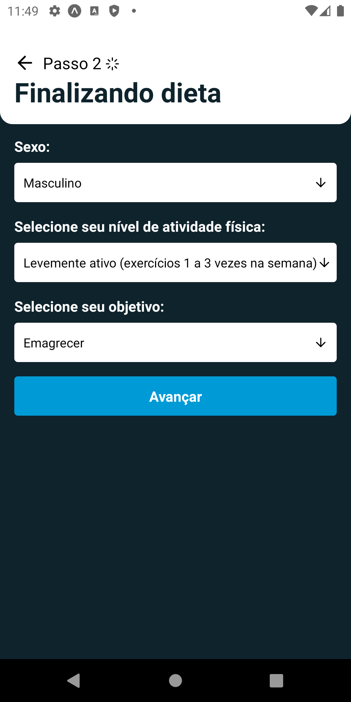
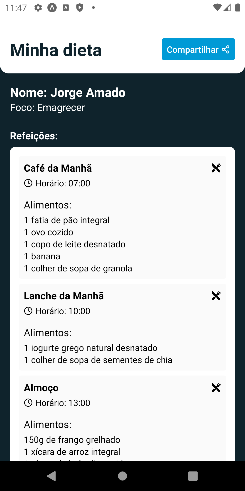
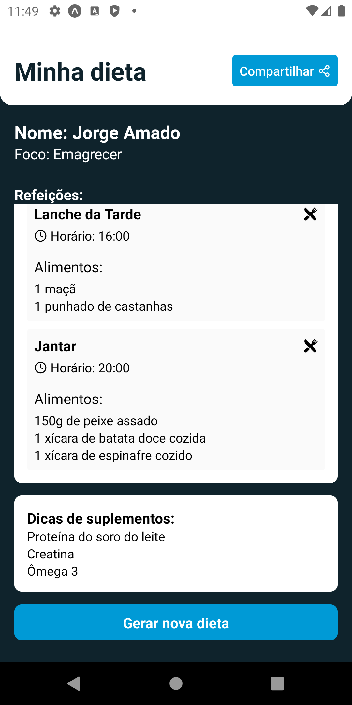

<h1 align="center">
  
</h1>

<h4 align="center">
  Dieta.IA
</h4>

## 💻 Projeto

Projeto desenvolvido com base nas aulas do evento **Aplicativo gerador de dietas + IA completo**, oferecido por [Sujeito Programador][sujeitoprogramador].

## 🛠 Tecnologias

As seguintes tecnologias foram utilizadas no desenvolvimento do projeto:

- [Node.js][nodejs]
- [React Native][reactnative]

## 📷 Screenshots

<kbd>
  
</kbd>

 

<kbd>
  
</kbd>

 

<kbd>
  
</kbd>

 

<kbd>
  
</kbd>

 

<kbd>
  
</kbd>

 

<kbd>
  
</kbd>

[sujeitoprogramador]: https://sujeitoprogramador.com/
[nodejs]: https://nodejs.org/en/
[reactnative]: https://reactnative.dev/
